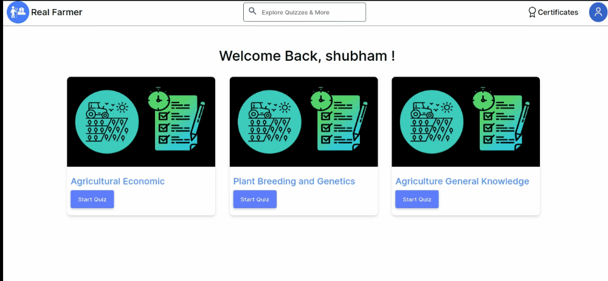

# Real farmer

[](https://app.netlify.com/sites/realfarmer-quiz/deploys)

## About This Project

Real Farmer is a full stack app made using MERN and Typescript. Users can play quizzes and get certificates can share those certificates among others. This app runs on a custom server built with express, can be found here :[`Quiz server`](https://github.com/shubham-ghuge/real-farmer-backend/tree/dev).

## Preview



## Features

1. Users can download and share Quiz Certificates.
2. Landing page listed with available quizes and fancy particle banner
3. Quiz page with navigation to next and previous questiosn
4. Result page with details of your performance in the Quiz
5. JWT Authentication.
6. Aesthetic and Mobile responsive Design.

## Run Locally

Clone the project

```bash
  git clone git@github.com:shubham-ghuge/real-farmer.git
```

Go to the project directory

```bash
  cd sell-at-farmersGrocery
```

Install dependencies

```bash
  npm install
```

Start the server

```bash
  npm run start
```
